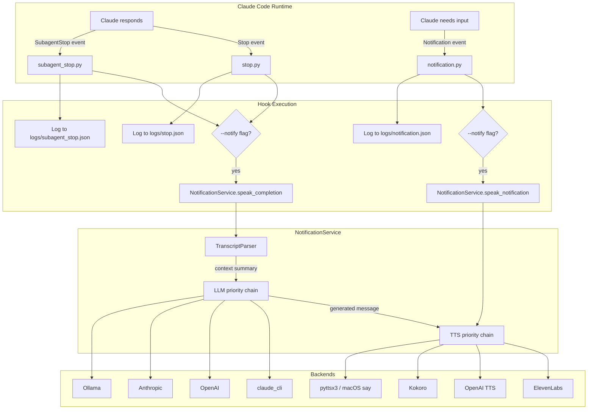
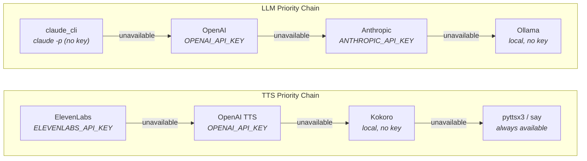

# Claude Code Hook Notification System

## Overview

Claude Code exposes lifecycle hooks -- Python scripts invoked at specific events during a session.
This dotfiles repository uses three hooks to drive a voice notification system that announces task
completions and prompts for user input via speech synthesis. The system is entirely optional: hooks
log events regardless, and speech activates only when the `--notify` flag is present.

The hooks live at `~/.claude/hooks/` and are configured in
[`~/.claude/settings.json`](../.claude/settings.json).

---

## Architecture

### System Flow



### TTS and LLM Fallback Chains

Each chain tries backends in priority order, falling through to the next on failure or unavailability (missing API key, service down).



---

## File Layout

```
~/.claude/hooks/
├── stop.py                    # Stop lifecycle hook
├── notification.py            # Notification lifecycle hook
├── subagent_stop.py           # SubagentStop lifecycle hook
# (session_start.py, pre_tool_use.py, post_tool_use.py, pre_compact.py,
#  and user_prompt_submit.py are lifecycle hooks outside this document's scope)
└── utils/
    ├── common.py              # Backend, TranscriptParser, NotificationService, build_service()
    ├── tts/
    │   ├── elevenlabs_tts.py  # Cloud TTS (ELEVENLABS_API_KEY)
    │   ├── openai_tts.py      # Cloud TTS (OPENAI_API_KEY)
    │   ├── kokoro_tts.py      # Local neural TTS (HF Kokoro-82M, ~90 MB)
    │   └── pyttsx3_tts.py     # macOS say fallback (always available)
    └── llm/
        ├── claude_cli.py      # claude -p with Claude Code auth (no API key)
        ├── oai.py             # OpenAI chat completions
        ├── anth.py            # Anthropic messages API
        └── ollama.py          # Local Ollama inference
```

Source files in the chezmoi repo: [`dot_claude/hooks/`](../dot_claude/hooks/).

---

## Hook Scripts

### Shared Behavior

All three hook scripts follow the same pattern:

1. **Recursion guard** -- if `_CLAUDE_HOOK_GENERATING=1` is set in the environment, exit
   immediately. This prevents infinite loops when `claude -p` (invoked by the `claude_cli` LLM
   backend) fires its own Stop hook.
2. **Read JSON from stdin** -- Claude Code pipes event data as a JSON object.
3. **Append to log file** -- the event JSON is appended to a JSON array log file in a `logs/`
   directory relative to the working directory at hook invocation time.
4. **Optional speech** -- if the `--notify` flag was passed, invoke the `NotificationService`.
5. **Exit 0 always** -- hooks must never block Claude or cause a non-zero exit.

### stop.py

Fires on the **Stop** event (Claude finishes a response).

- Logs to `logs/stop.json`
- `--notify` flag: calls `NotificationService.speak_completion(transcript_path)`
- `--chat` flag: copies the session transcript to `logs/chat.json` for external consumption

### subagent_stop.py

Fires on the **SubagentStop** event (a sub-agent finishes). Behavior is identical to `stop.py`.

### notification.py

Fires on the **Notification** event (Claude needs user input).

- Logs to `logs/notification.json`
- `--notify` flag: calls `NotificationService.speak_notification(message)`

---

## Core Classes

All core classes live in [`utils/common.py`](../.claude/hooks/utils/common.py).

### Backend

`Backend` is a dataclass representing a single TTS or LLM backend.

| Field     | Type              | Purpose                                               |
|-----------|-------------------|-------------------------------------------------------|
| `name`    | `str`             | Human-readable identifier                             |
| `script`  | `Path`            | Path to the backend script (invoked via `uv run --script`) |
| `env_key` | `Optional[str]`   | Environment variable required for availability        |
| `timeout` | `int`             | Subprocess timeout in seconds                         |

**Key methods:**

- `is_available() -> bool` -- returns `True` if `env_key` is set, or `None` (no key required).
- `run(*args) -> Optional[str]` -- executes the backend script via `uv run --script`, passing
  `*args` as command-line arguments. Returns stdout on success, `None` on failure. Does not raise.

### TranscriptParser

`TranscriptParser` extracts a concise summary from a Claude Code JSONL transcript file.

**`parse(transcript_path, max_entries=60) -> Optional[str]`**

Reads the transcript JSONL, retains the last 60 entries via `deque(maxlen=60)`, and produces a structured summary:

```
Request: <last user message, max 200 chars>
Actions: Edit hooks/stop.py, Bash(pytest tests/), Agent(Create PR)
Outcome: <last assistant text, max 300 chars>
```

The Actions line lists deduplicated tool calls from a recognized set: Edit, Write, Bash, Agent, Glob, Grep, WebFetch, WebSearch. The total summary is capped at 800 characters.

### NotificationService

`NotificationService` orchestrates the TTS and LLM backend chains to produce spoken notifications.

**`speak_completion(transcript_path) -> None`**

1. Verify at least one TTS backend is available; return silently if not.
2. Check LLM backends. If one is available, parse the transcript for context via `TranscriptParser`.
3. Call the first available LLM with `--completion [--context <summary>]` to generate a context-aware spoken message.
4. Pass the generated message to the first available TTS backend.
5. With no LLM available, select a random fallback message and speak it.

**`speak_notification(message) -> None`**

- If the message contains real content, speak it verbatim.
- Otherwise, speak a generic prompt ("Your input is needed") with a 30% chance of name personalization via `ENGINEER_NAME` (e.g., "Nehal, your input is needed").

### build_service(hooks_dir) -> NotificationService

Factory function that constructs a `NotificationService` with the default TTS and LLM priority chains. All hook scripts use this as their single entry point.

---

## Context-Aware Message Generation

When an LLM backend generates a completion message, it receives transcript context and produces a specific announcement rather than a generic one.

**Example context passed to the LLM:**

```
Request: Refactor the notification hooks to use dataclasses
Actions: Edit hooks/stop.py, Edit utils/common.py, Bash(pytest tests/)
Outcome: All 27 tests passing. Refactored Backend and NotificationService to use dataclasses.
```

**Example generated message:** "Refactoring complete -- all tests green."

Without context (no LLM available), the system speaks a random generic message from a built-in list.

---

## TTS Backends

### ElevenLabs (cloud, highest quality)

- Script: [`utils/tts/elevenlabs_tts.py`](../.claude/hooks/utils/tts/elevenlabs_tts.py)
- Requires: `ELEVENLABS_API_KEY`
- Highest fidelity; cloud latency

### OpenAI TTS (cloud)

- Script: [`utils/tts/openai_tts.py`](../.claude/hooks/utils/tts/openai_tts.py)
- Requires: `OPENAI_API_KEY`
- Good quality; shares key with OpenAI LLM backend

### Kokoro (local neural)

- Script: [`utils/tts/kokoro_tts.py`](../.claude/hooks/utils/tts/kokoro_tts.py)
- Requires: nothing (model auto-downloaded from [HF hexgrad/Kokoro-82M](https://huggingface.co/hexgrad/Kokoro-82M) on first use, ~90 MB)
- Default voice: `af_heart` (warm American female; configurable via `KOKORO_VOICE` in `~/.env`)
- [Explore all voices](https://huggingface.co/hexgrad/Kokoro-82M/blob/main/VOICES.md): American/British, female/male (`af_`, `am_`, `bf_`, `bm_` prefixes)
- Runs entirely locally; no API key required
- `HF_TOKEN` required only for gated models (Kokoro-82M is public)

### pyttsx3 / macOS say (fallback)

- Script: [`utils/tts/pyttsx3_tts.py`](../.claude/hooks/utils/tts/pyttsx3_tts.py)
- Requires: nothing (always available on macOS)
- Lowest quality; zero latency; guaranteed availability

---

## LLM Backends

### claude_cli (Claude Code auth)

- Script: [`utils/llm/claude_cli.py`](../.claude/hooks/utils/llm/claude_cli.py)
- Requires: nothing (uses Claude Code's own authentication via `claude -p`)
- Sets `_CLAUDE_HOOK_GENERATING=1` to prevent recursion
- Uses `claude-haiku-4-5-20251001` for fast, low-cost generation

### OpenAI

- Script: [`utils/llm/oai.py`](../.claude/hooks/utils/llm/oai.py)
- Requires: `OPENAI_API_KEY`

### Anthropic

- Script: [`utils/llm/anth.py`](../.claude/hooks/utils/llm/anth.py)
- Requires: `ANTHROPIC_API_KEY`
- Not needed if using Claude Max subscription (covered by `claude_cli`)

### Ollama (local)

- Script: [`utils/llm/ollama.py`](../.claude/hooks/utils/llm/ollama.py)
- Requires: nothing (local Ollama server)
- Useful as final fallback when no API keys are available

---

## Configuration

### Hook Registration (settings.json)

Hooks are registered in [`~/.claude/settings.json`](../.claude/settings.json):

```json
{
  "hooks": {
    "Stop": [
      {
        "matcher": {},
        "hooks": [
          {
            "type": "command",
            "command": "~/.claude/hooks/stop.py --notify --chat"
          }
        ]
      }
    ],
    "Notification": [
      {
        "matcher": {},
        "hooks": [
          {
            "type": "command",
            "command": "~/.claude/hooks/notification.py --notify"
          }
        ]
      }
    ],
    "SubagentStop": [
      {
        "matcher": {},
        "hooks": [
          {
            "type": "command",
            "command": "~/.claude/hooks/subagent_stop.py --notify"
          }
        ]
      }
    ]
  }
}
```

`matcher: {}` matches all events without filtering. Remove `--notify` to disable speech while retaining logging. Remove `--chat` to disable transcript copying.

### Environment Variables

Set in `~/.env` (mode 600, sourced by shell profile):

| Variable             | Required for            | Notes                                              |
|----------------------|-------------------------|----------------------------------------------------|
| `ELEVENLABS_API_KEY` | ElevenLabs TTS          | Highest quality voice synthesis                    |
| `OPENAI_API_KEY`     | OpenAI TTS + LLM        | Enables both OpenAI backends                       |
| `ANTHROPIC_API_KEY`  | Anthropic LLM           | Not needed with Claude Max (use `claude_cli`)      |
| `ENGINEER_NAME`      | Personalized prompts    | 30% chance of "Name, your input is needed"         |
| `HF_TOKEN`           | Gated HF models only    | Not needed for Kokoro-82M (public model)           |
| `KOKORO_VOICE`       | Kokoro voice selection  | Default: `af_heart`; see [VOICES.md](https://huggingface.co/hexgrad/Kokoro-82M/blob/main/VOICES.md) for all options |

---

## Recursion Guard

The `claude_cli` LLM backend invokes `claude -p <prompt>`, which fires a Stop hook on completion. Without protection, this creates an infinite loop: Stop -> speak -> claude -p -> Stop -> speak -> ...

The guard works in two layers:

1. **`claude_cli.py`** sets `_CLAUDE_HOOK_GENERATING=1` in the subprocess environment before
   calling `claude -p`.
2. **Every hook script** checks for `_CLAUDE_HOOK_GENERATING=1` at startup and exits immediately
   if set.

The nested `claude -p` invocation completes silently without triggering another notification cycle.

---

## Extensibility

### Adding a New TTS Backend

1. Create a Python script at `~/.claude/hooks/utils/tts/<name>_tts.py`.
2. The script must accept text as a positional argument and speak it.
3. Use `uv run --script` inline metadata for dependencies.
4. Add a `Backend(...)` entry to the TTS list in `build_service()` in `utils/common.py`.

### Adding a New LLM Backend

1. Create a Python script at `~/.claude/hooks/utils/llm/<name>.py`.
2. The script must accept `--completion [--context <str>]` and print the generated message to
   stdout.
3. Add a `Backend(...)` entry to the LLM list in `build_service()`.

Backend scripts are invoked via `uv run --script` and declare their own dependencies inline without affecting the global environment.

---

## Testing

### Unit Tests (`tests/test_hooks.py`)

27 tests covering:

- `Backend` availability checks and subprocess execution
- `TranscriptParser` parsing logic, deque windowing, and summary formatting
- `NotificationService` fallback behavior and chain traversal
- `build_service()` factory construction

### Integration Tests (`tests/test_hooks_integration.py`)

19 behavioral tests covering:

- Hook script subprocess invocation with stdin JSON piping
- Log file creation and JSON array append semantics
- Recursion guard (`_CLAUDE_HOOK_GENERATING=1` causes immediate exit)
- `--chat` flag transcript copying
- `--notify` flag speech invocation (mocked backends)

Run the test suite:

```bash
cd ~/.local/share/chezmoi && uv run --with pytest python3 -m pytest tests/ -v
```

---

## Design Rationale

**Exit 0 always.** Hooks must never block the Claude Code session. All errors are swallowed; a failed notification is acceptable, a hung session is not.

**Priority chains over configuration.** The system tries all available backends in quality order rather than requiring users to configure a specific TTS or LLM backend. A fresh install with no API keys works via Kokoro (TTS) and Ollama or `claude_cli` (LLM).

**`uv run --script` for isolation.** Each backend script declares its own dependencies via PEP 723 inline metadata. There is no shared virtual environment to manage; `uv` handles caching automatically.

**JSON array log files.** Logs accumulate as JSON arrays rather than JSONL, simplifying consumption by external tools while keeping the append logic straightforward.

**Transcript windowing.** `TranscriptParser` uses `deque(maxlen=60)` to bound memory usage on long sessions. Only the tail of the conversation matters for generating a relevant spoken message.
